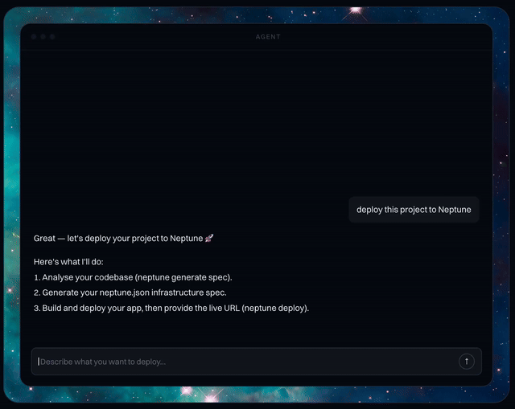

<p align="center">
  
</p>

<p align="center">
  <em>Give your coding agents DevOps superpowers</em>
</p>

<p align="center">
   
</p>

## What is Neptune?

Neptune is an app deployment platform built for AI agents that gives your agents real DevOps abilities. It reads your code, infers the infra it needs, and generates a simple IaC spec you can inspect, approve, and apply. Think: coding agents that can actually ship safely to AWS.

## Deploy Your First App

Follow the steps below and you can deploy your app in minutes.

Install the Neptune MCP server:

```bash
curl -LsSf https://neptune.dev/install.sh | bash
```

**Windows (PowerShell):**

```powershell
irm https://neptune.dev/install.ps1 | iex
```

## Getting Started

For Cursor, go to Cursor Settings -> Tools & MCP -> New MCP Server:

```json
{
    "mcpServers": {
        "neptune": {
            "command": "neptune",
            "args": ["mcp"]
        }
    }
}
```

## Deploy Your App

That's it! Now just tell your agent to deploy your app for you, and Neptune will handle the rest.

## Local Development

To test local changes to the MCP server, update your MCP config to point to your local repo:

```json
{
    "mcpServers": {
        "neptune": {
            "type": "stdio",
            "command": "uv",
            "args": [
                "run",
                "--directory",
                "/path/to/neptune-mcp",
                "neptune",
                "mcp"
            ]
        }
    }
}
```

Replace `/path/to/neptune-mcp` with the absolute path to your local clone.

After updating the config, restart Cursor (or reload the MCP server) for changes to take effect.

You can also verify the MCP server starts correctly from the terminal:

```shell
uv run neptune mcp
```
